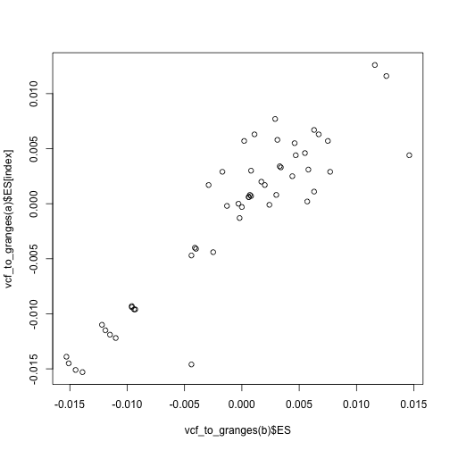

We developed a format for storing and harmonising GWAS summary data known as [GWAS VCF format](https://github.com/MRCIEU/gwas-vcf-specification). This format is effective for being very fast when querying chromosome and position ranges, handling multiallelic variants and indels. 

All the data in the [IEU GWAS database](https://gwas.mrcieu.ac.uk/) is available for download in the GWAS VCF format. This R package provides fast and convenient functions for querying and creating GWAS summary data in GWAS VCF format. The package builds on the [VariantAnnotation](https://bioconductor.org/packages/release/bioc/html/VariantAnnotation.html) Bioconductor package, which itself is based on the widely used [SummarizedExperiment](https://bioconductor.org/packages/release/bioc/html/SummarizedExperiment.html) Bioconductor package.


## External tools

For some VCF querying functions it is faster to optionally use [bcftools](https://samtools.github.io/bcftools/bcftools.html), and when available the R package will use that strategy. To set a location for the bcftools package, use

```r
library(gwasvcf)
set_bcftools('/path/to/bcftools')
```

Note that there is bcftools binary for Windows available, so some querying options will be slower on Windows.

For LD related functions the package uses [plink 1.90](https://www.cog-genomics.org/plink/1.9). You can specify the location of your plink installation by running

```r
set_plink('/path/to/plink')
```

Alternatively you can automatically use use the binaries bundled here: https://github.com/mrcieu/genetics.binaRies 

```r
remotes::install_github('mrcieu/genetics.binaRies')
set_plink()
set_bcftools()
```

To unset a path:

```r
set_plink(NULL)
set_bcftools(NULL)
```

For this vignette we will use the bundled binaries in `genetics.binaRies`.


``` r
suppressWarnings(suppressPackageStartupMessages({
  library(gwasvcf)
  library(VariantAnnotation)
  library(dplyr)
  library(magrittr)
}))
```

``` r
set_bcftools()
#> Path not provided, using binaries in the MRCIEU/genetics.binaRies package
```

## Reading in everything

To read an entire dataset use the `readVcf` function. As an example we'll use the bundled data which is a small subset of the Speliotes et al 2010 BMI GWAS.


``` r
vcffile <- system.file("extdata", "data.vcf.gz", package="gwasvcf")
vcf <- readVcf(vcffile)
class(vcf)
#> [1] "CollapsedVCF"
#> attr(,"package")
#> [1] "VariantAnnotation"
```

Please refer to the `VariantAnnotation` package documentation for full details about the `CollapsedVCF` object. A brief summary follows.

General info about the dataset can be obtained by calling it:


``` r
vcf
#> class: CollapsedVCF 
#> dim: 92 1 
#> rowRanges(vcf):
#>   GRanges with 5 metadata columns: paramRangeID, REF, ALT, QUAL, FILTER
#> info(vcf):
#>   DataFrame with 1 column: AF
#> info(header(vcf)):
#>       Number Type  Description     
#>    AF A      Float Allele Frequency
#> geno(vcf):
#>   List of length 9: ES, SE, LP, AF, SS, EZ, SI, NC, ID
#> geno(header(vcf)):
#>       Number Type   Description                                                     
#>    ES A      Float  Effect size estimate relative to the alternative allele         
#>    SE A      Float  Standard error of effect size estimate                          
#>    LP A      Float  -log10 p-value for effect estimate                              
#>    AF A      Float  Alternate allele frequency in the association study             
#>    SS A      Float  Sample size used to estimate genetic effect                     
#>    EZ A      Float  Z-score provided if it was used to derive the EFFECT and SE f...
#>    SI A      Float  Accuracy score of summary data imputation                       
#>    NC A      Float  Number of cases used to estimate genetic effect                 
#>    ID 1      String Study variant identifier
```

There are 92 rows and 1 column which means 92 SNPs and one GWAS. See the header information:


``` r
header(vcf)
#> class: VCFHeader 
#> samples(1): IEU-a-2
#> meta(4): fileformat META SAMPLE contig
#> fixed(1): FILTER
#> info(1): AF
#> geno(9): ES SE ... NC ID
```

See the names of the GWAS datasets (in this case just one, and it refers to the IEU GWAS database ID name):


``` r
samples(header(vcf))
#> [1] "IEU-a-2"
```

In this case you can obtain information about this study through the `ieugwasr` package e.g. `ieugwasr::gwasinfo("IEU-a-2")`.

There are a few components within the object:

- `header` which has the meta data describing the dataset, including the association result variables
- `rowRanges` which is information about each variant
- `info` which is further metadata about each variant
- `geno` which is the actual association results for each GWAS

the `rowRanges` object is a `GenomicRanges` class, which is useful for performing fast operations on chromosome position information.


``` r
rowRanges(vcf)
#> GRanges object with 92 ranges and 5 metadata columns:
#>              seqnames    ranges strand | paramRangeID            REF
#>                 <Rle> <IRanges>  <Rle> |     <factor> <DNAStringSet>
#>   rs12565286        1    721290      * |           NA              G
#>   rs11804171        1    723819      * |           NA              T
#>    rs2977670        1    723891      * |           NA              G
#>    rs3094315        1    752566      * |           NA              G
#>    rs2073813        1    753541      * |           NA              G
#>          ...      ...       ...    ... .          ...            ...
#>     rs715643        1   1172907      * |           NA              C
#>    rs6675798        1   1176597      * |           NA              T
#>    rs6603783        1   1181751      * |           NA              T
#>    rs6603785        1   1186502      * |           NA              A
#>    rs6603787        1   1188225      * |           NA              G
#>                             ALT      QUAL      FILTER
#>              <DNAStringSetList> <numeric> <character>
#>   rs12565286                  C        NA        PASS
#>   rs11804171                  A        NA        PASS
#>    rs2977670                  C        NA        PASS
#>    rs3094315                  A        NA        PASS
#>    rs2073813                  A        NA        PASS
#>          ...                ...       ...         ...
#>     rs715643                  T        NA        PASS
#>    rs6675798                  C        NA        PASS
#>    rs6603783                  C        NA        PASS
#>    rs6603785                  T        NA        PASS
#>    rs6603787                  T        NA        PASS
#>   -------
#>   seqinfo: 84 sequences from GRCh37 genome
```

## Converting to simple dataframes

The VCF object is somewhat complex and you can read more about it in the [VariantAnnotation package documentation](https://bioconductor.org/packages/release/bioc/html/VariantAnnotation.html). You can create various other formats that might be easier to use from it. For example, create a `GRanges` object which is great for fast chromosome-position operations


``` r
vcf_to_granges(vcf)
#> GRanges object with 92 ranges and 15 metadata columns:
#>              seqnames    ranges strand | paramRangeID         REF         ALT
#>                 <Rle> <IRanges>  <Rle> |     <factor> <character> <character>
#>   rs12565286        1    721290      * |           NA           G           C
#>   rs11804171        1    723819      * |           NA           T           A
#>    rs2977670        1    723891      * |           NA           G           C
#>    rs3094315        1    752566      * |           NA           G           A
#>    rs2073813        1    753541      * |           NA           G           A
#>          ...      ...       ...    ... .          ...         ...         ...
#>     rs715643        1   1172907      * |           NA           C           T
#>    rs6675798        1   1176597      * |           NA           T           C
#>    rs6603783        1   1181751      * |           NA           T           C
#>    rs6603785        1   1186502      * |           NA           A           T
#>    rs6603787        1   1188225      * |           NA           G           T
#>                   QUAL      FILTER        ES        SE        LP        AF        SS
#>              <numeric> <character> <numeric> <numeric> <numeric> <numeric> <numeric>
#>   rs12565286        NA        PASS   -0.0067    0.0145 0.1930060   0.93220  109823.0
#>   rs11804171        NA        PASS   -0.0146    0.0175 0.3935110   0.96296   84828.0
#>    rs2977670        NA        PASS    0.0044    0.0184 0.0909791   0.07143   68458.9
#>    rs3094315        NA        PASS    0.0060    0.0065 0.4485500   0.15520  131544.0
#>    rs2073813        NA        PASS    0.0035    0.0102 0.1357860        NA   64351.3
#>          ...       ...         ...       ...       ...       ...       ...       ...
#>     rs715643        NA        PASS    0.0019    0.0118 0.0594337   0.90833    121822
#>    rs6675798        NA        PASS   -0.0013    0.0067 0.0725270   0.89170    223475
#>    rs6603783        NA        PASS   -0.0002    0.0069 0.0101499   0.90000    220022
#>    rs6603785        NA        PASS    0.0075    0.0104 0.3271640   0.91667    165964
#>    rs6603787        NA        PASS    0.0025    0.0089 0.1085740        NA    199099
#>                     EZ        SI        NC          ID          id
#>              <numeric> <numeric> <numeric> <character> <character>
#>   rs12565286        NA        NA        NA  rs12565286     IEU-a-2
#>   rs11804171        NA        NA        NA  rs11804171     IEU-a-2
#>    rs2977670        NA        NA        NA   rs2977670     IEU-a-2
#>    rs3094315        NA        NA        NA   rs3094315     IEU-a-2
#>    rs2073813        NA        NA        NA   rs2073813     IEU-a-2
#>          ...       ...       ...       ...         ...         ...
#>     rs715643        NA        NA        NA    rs715643     IEU-a-2
#>    rs6675798        NA        NA        NA   rs6675798     IEU-a-2
#>    rs6603783        NA        NA        NA   rs6603783     IEU-a-2
#>    rs6603785        NA        NA        NA   rs6603785     IEU-a-2
#>    rs6603787        NA        NA        NA   rs6603787     IEU-a-2
#>   -------
#>   seqinfo: 84 sequences from GRCh37 genome
```

Create a data frame:


``` r
vcf_to_granges(vcf) %>% dplyr::as_tibble()
#> # A tibble: 92 × 20
#>    seqnames  start    end width strand paramRangeID REF   ALT    QUAL FILTER      ES
#>    <fct>     <int>  <int> <int> <fct>  <fct>        <chr> <chr> <dbl> <chr>    <dbl>
#>  1 1        721290 721290     1 *      <NA>         G     C        NA PASS   -0.0067
#>  2 1        723819 723819     1 *      <NA>         T     A        NA PASS   -0.0146
#>  3 1        723891 723891     1 *      <NA>         G     C        NA PASS    0.0044
#>  4 1        752566 752566     1 *      <NA>         G     A        NA PASS    0.006 
#>  5 1        753541 753541     1 *      <NA>         G     A        NA PASS    0.0035
#>  6 1        754192 754192     1 *      <NA>         A     G        NA PASS    0.0077
#>  7 1        768448 768448     1 *      <NA>         G     A        NA PASS   -0.0027
#>  8 1        775659 775659     1 *      <NA>         A     G        NA PASS    0.0029
#>  9 1        777122 777122     1 *      <NA>         A     T        NA PASS    0.0031
#> 10 1        779322 779322     1 *      <NA>         A     G        NA PASS   -0.0062
#> # ℹ 82 more rows
#> # ℹ 9 more variables: SE <dbl>, LP <dbl>, AF <dbl>, SS <dbl>, EZ <dbl>, SI <dbl>,
#> #   NC <dbl>, ID <chr>, id <chr>
```

The direct conversion to formats for tools such as TwoSampleMR, coloc, and many others can also be made using the [https://github.com/mrcieu/gwasglue](https://github.com/mrcieu/gwasglue) R package.

## Reading in with filters

The `query_gwas()` function takes either a filename to a vcf file, or vcf object as the main argument. You can then query on `rsid`, `pval` or `chrompos`. For example


``` r
vcfsubset <- query_gwas(vcffile, chrompos=c("1:1097291-1099437"))
```

and


``` r
vcf <- readVcf(vcffile)
vcfsubset <- query_gwas(vcf, chrompos=c("1:1097291-1099437"))
```

are each identical, but the former saves time and memory because it is querying the file using an index and only reading in what is required.

Examples of other filters are here:


``` r
vcf <- query_gwas(vcffile, rsid=c("rs3128126", "rs3121561", "rs3813193"))
vcf
#> class: CollapsedVCF 
#> dim: 3 1 
#> rowRanges(vcf):
#>   GRanges with 5 metadata columns: paramRangeID, REF, ALT, QUAL, FILTER
#> info(vcf):
#>   DataFrame with 3 columns: AF, AC, AN
#> info(header(vcf)):
#>       Number Type    Description                                
#>    AF A      Float   Allele Frequency                           
#>    AC A      Integer Allele count in genotypes                  
#>    AN 1      Integer Total number of alleles in called genotypes
#> geno(vcf):
#>   List of length 9: ES, SE, LP, AF, SS, EZ, SI, NC, ID
#> geno(header(vcf)):
#>       Number Type   Description                                                     
#>    ES A      Float  Effect size estimate relative to the alternative allele         
#>    SE A      Float  Standard error of effect size estimate                          
#>    LP A      Float  -log10 p-value for effect estimate                              
#>    AF A      Float  Alternate allele frequency in the association study             
#>    SS A      Float  Sample size used to estimate genetic effect                     
#>    EZ A      Float  Z-score provided if it was used to derive the EFFECT and SE f...
#>    SI A      Float  Accuracy score of summary data imputation                       
#>    NC A      Float  Number of cases used to estimate genetic effect                 
#>    ID 1      String Study variant identifier
```


``` r
vcf <- query_gwas(vcffile, pval=0.5)
vcf
#> class: CollapsedVCF 
#> dim: 45 1 
#> rowRanges(vcf):
#>   GRanges with 5 metadata columns: paramRangeID, REF, ALT, QUAL, FILTER
#> info(vcf):
#>   DataFrame with 3 columns: AF, AC, AN
#> info(header(vcf)):
#>       Number Type    Description                                
#>    AF A      Float   Allele Frequency                           
#>    AC A      Integer Allele count in genotypes                  
#>    AN 1      Integer Total number of alleles in called genotypes
#> geno(vcf):
#>   List of length 9: ES, SE, LP, AF, SS, EZ, SI, NC, ID
#> geno(header(vcf)):
#>       Number Type   Description                                                     
#>    ES A      Float  Effect size estimate relative to the alternative allele         
#>    SE A      Float  Standard error of effect size estimate                          
#>    LP A      Float  -log10 p-value for effect estimate                              
#>    AF A      Float  Alternate allele frequency in the association study             
#>    SS A      Float  Sample size used to estimate genetic effect                     
#>    EZ A      Float  Z-score provided if it was used to derive the EFFECT and SE f...
#>    SI A      Float  Accuracy score of summary data imputation                       
#>    NC A      Float  Number of cases used to estimate genetic effect                 
#>    ID 1      String Study variant identifier
```


``` r
vcf <- query_gwas(vcffile, chrompos=c("1:1097291-1099437"))
vcf
#> class: CollapsedVCF 
#> dim: 2 1 
#> rowRanges(vcf):
#>   GRanges with 5 metadata columns: paramRangeID, REF, ALT, QUAL, FILTER
#> info(vcf):
#>   DataFrame with 3 columns: AF, AC, AN
#> info(header(vcf)):
#>       Number Type    Description                                
#>    AF A      Float   Allele Frequency                           
#>    AC A      Integer Allele count in genotypes                  
#>    AN 1      Integer Total number of alleles in called genotypes
#> geno(vcf):
#>   List of length 9: ES, SE, LP, AF, SS, EZ, SI, NC, ID
#> geno(header(vcf)):
#>       Number Type   Description                                                     
#>    ES A      Float  Effect size estimate relative to the alternative allele         
#>    SE A      Float  Standard error of effect size estimate                          
#>    LP A      Float  -log10 p-value for effect estimate                              
#>    AF A      Float  Alternate allele frequency in the association study             
#>    SS A      Float  Sample size used to estimate genetic effect                     
#>    EZ A      Float  Z-score provided if it was used to derive the EFFECT and SE f...
#>    SI A      Float  Accuracy score of summary data imputation                       
#>    NC A      Float  Number of cases used to estimate genetic effect                 
#>    ID 1      String Study variant identifier
```

It's possible to chain filters together e.g.


``` r
vcf <- query_gwas(vcffile, rsid=c("rs3128126", "rs3121561", "rs3813193")) %>%
    query_gwas(pval=0.5)
vcf
#> class: CollapsedVCF 
#> dim: 1 1 
#> rowRanges(vcf):
#>   GRanges with 5 metadata columns: paramRangeID, REF, ALT, QUAL, FILTER
#> info(vcf):
#>   DataFrame with 3 columns: AF, AC, AN
#> info(header(vcf)):
#>       Number Type    Description                                
#>    AF A      Float   Allele Frequency                           
#>    AC A      Integer Allele count in genotypes                  
#>    AN 1      Integer Total number of alleles in called genotypes
#> geno(vcf):
#>   List of length 9: ES, SE, LP, AF, SS, EZ, SI, NC, ID
#> geno(header(vcf)):
#>       Number Type   Description                                                     
#>    ES A      Float  Effect size estimate relative to the alternative allele         
#>    SE A      Float  Standard error of effect size estimate                          
#>    LP A      Float  -log10 p-value for effect estimate                              
#>    AF A      Float  Alternate allele frequency in the association study             
#>    SS A      Float  Sample size used to estimate genetic effect                     
#>    EZ A      Float  Z-score provided if it was used to derive the EFFECT and SE f...
#>    SI A      Float  Accuracy score of summary data imputation                       
#>    NC A      Float  Number of cases used to estimate genetic effect                 
#>    ID 1      String Study variant identifier
```

It's possible to have multiple GWAS studies per vcf. You can specify specific GWAS studies to read in using e.g.


``` r
vcf <- query_gwas(vcffile, rsid=c("rs3128126", "rs3121561", "rs3813193"), id="IEU-a-2")
```

Note that querying by chrompos is the fastest way to deal with VCFs, use this over rsid where possible when speed is an issue.

## Indexing rsid values

Querying by rsid is slow. If a large number of queries by rsid are to be performed then it could be worth generating an index which would speed up the querying. This approach uses [SQLite](https://www.sqlite.org/index.html) to create a local database, linking rsid to chromosome and position. It strips out the 'rs' from the rs identifiers to make fast searchers by integer. The concept is based on that developed here: [bioforensics/rsidx](https://github.com/bioforensics/rsidx).

To create the index:


``` r
create_rsidx_index_from_vcf(vcffile, "index.rsidx")
#> Extracting position info
#> Generating index
```

To query using the index:


``` r
vcf <- query_gwas(vcffile, rsid=c("rs3128126", "rs3121561", "rs3813193"), rsidx="index.rsidx")
```

## Indexing p-values

Querying by p-value is slow. It could be worth generating an index file for p-values to speed this up. Similar to rsid queries, it uses an sqlite database linking -log10 pvalues to chromosome and position. 

To create the index:


``` r
create_pval_index_from_vcf(vcffile, maximum_pval=0.05, "index.pvali")
#> Extracting pval info
#> [1] "CREATE TABLE pval_to_coord (chrom TEXT NOT NULL DEFAULT NULL, coord INTEGER NOT NULL DEFAULT NULL, LP REAL NOT NULL DEFAULT 0);"
#> [2] ".separator ,"                                                                                                                   
#> [3] ".import /var/folders/9j/bw4vdrw94yndry3z9cv8ms1m0000gn/T//RtmpFnAKs1/file22f4fdc3a4d pval_to_coord"                             
#> [4] "CREATE INDEX idx_LP ON pval_to_coord (LP)"
#> Generating index
```

To query using the index:


``` r
vcf <- query_gwas(vcffile, pval=0.05, pvali="index.pvali")
#> Using pval index
#> Identified 7 variants passing threshold. Extracting...
```

## A note about chrompos

The fastest way to query VCFs is by specifying chromosome and position. Can specify specific positions, or ranges. e.g.


``` r
cp <- c("1:10000", "2:10000-20000")
```

or as a data frame


``` r
cp <- dplyr::tibble(chrom=c(1,2), start=c(10000,10000), end=c(10000, 20000))
```

You can check what will be parsed out with:


``` r
parse_chrompos(cp)
#> GRanges object with 2 ranges and 0 metadata columns:
#>       seqnames      ranges strand
#>          <Rle>   <IRanges>  <Rle>
#>   [1]        1       10000      *
#>   [2]        2 10000-20000      *
#>   -------
#>   seqinfo: 2 sequences from an unspecified genome; no seqlengths
```

Querying by p-value or rsid is also possible but is slower as only chrompos is indexed. On Mac and Linux, rsid and p-value queries are performed by calls to bcftools. On Windows it uses VariantAnnotation directly, because bcftools binaries are not available. This is unfortunately somewhat slower. If many operations are being performed it might be faster to read in the whole dataset and perform queries that way.

## LD proxies

If a set of rsids are requested from a vcf but some are absent, a reference panel can be used to search for LD proxies, extract them, and align the effects and alleles against the original variants that were requested.

There are two ways to perform the LD proxy search:

- using a set of genotyped samples as an LD reference panel (e.g. 1000 genomes data) - this is slow but relatively convenient
- compiling an LD tag list from an LD reference panel - once generated this is very fast

### Using an LD reference panel

An LD reference panel can be obtained from here: [http://fileserve.mrcieu.ac.uk/ld/data_maf0.01_rs_ref.tgz](http://fileserve.mrcieu.ac.uk/ld/data_maf0.01_rs_ref.tgz). This dataset comprises Europeans from the 1000 genomes project, in plink format, and including only SNPs with MAF > 0.01, and with the reference alleles aligned to the human genome reference sequence. For this vignette we can use a small subset of that dataset:


``` r
ldfile <- system.file("extdata", "eur.bed", package="gwasvcf") %>% 
  gsub(".bed", "", .)
```

We also need to provide a path to the plink binary used to generate LD calculations. This can be done through the `genetics.binaRies` package as with bcftools


``` r
set_plink()
#> Path not provided, using binaries in the MRCIEU/genetics.binaRies package
```

The rs4442317 variant is not present in the vcf file, i.e. if we query that variant:


``` r
query_gwas(vcffile, rsid="rs4442317") %>% nrow
#> [1] 0
```


``` r
vcf <- query_gwas(vcffile, rsid="rs4442317", proxies="yes", bfile=ldfile, tag_r2=0.05)
#> Initial search...
#> Extracted 0 out of 1 rsids
#> Searching for proxies for 1 rsids
#> Determining searchspace...
#> Proxy lookup...
#> Finding proxies...
#> Found 10 proxies
#> Extrating proxies...
#> Identified proxies for 1 of 1 rsids
#> Aligning...
vcf %>% vcf_to_granges()
#> GRanges object with 1 range and 15 metadata columns:
#>             seqnames    ranges strand |         REF         ALT      QUAL
#>                <Rle> <IRanges>  <Rle> | <character> <character> <numeric>
#>   rs4442317        1   1106784      * |           T           C        NA
#>                  FILTER        ES        SE        LP        AF        SS        EZ
#>             <character> <numeric> <numeric> <numeric> <numeric> <numeric> <numeric>
#>   rs4442317        PASS    0.0059    0.0071  0.391474    0.8559    138001        NA
#>                    SI        NC          ID          PR          id
#>             <numeric> <numeric> <character> <character> <character>
#>   rs4442317        NA        NA   rs4970420   rs4970420     IEU-a-2
#>   -------
#>   seqinfo: 1 sequence from an unspecified genome; no seqlengths
```

Here we see that the proxy variant is rs4970420.

You may also extract only the best available proxies even if the requested rsids are present, by using `proxies="only"`. An example of this shows that the effect size estimates for the proxy variants are aligned to the effect alleles of the target variants:


``` r
# Read vcf
a <- readVcf(vcffile)

# Obtain the best LD proxy for each of the rsids
b <- query_gwas(vcffile, rsid=names(a), proxies="only", bfile=ldfile, tag_r2=0.6)
#> Determining searchspace...
#> Proxy lookup...
#> Finding proxies...
#> Found 270 proxies
#> Extrating proxies...
#> Identified proxies for 52 of 1 rsids
#> Aligning...

# Match the target data to the proxy data
index <- match(names(b), names(a))

# Plot the target data effects against the proxy data effects
plot(vcf_to_granges(b)$ES, vcf_to_granges(a)$ES[index])
```

<div class="figure">

<p class="caption">Plot the target data effects against the proxy data effects</p>
</div>

### Compiling a list of tagging variants

Using the LD reference panel described above, it is possible to create a sqlite tag reference panel using the following commands. First get an example LD reference panel:


``` r
ldfile <- system.file("extdata", "eur.bed", package="gwasvcf") %>% 
  gsub(".bed", "", .)
```

We also need to provide a path to the plink binary used to generate LD calculations. This can be done through the `genetics.binaRies` package as with bcftools


``` r
set_plink()
#> Path not provided, using binaries in the MRCIEU/genetics.binaRies package
```

Now generate the tagging database


``` r
dbfile <- tempfile()
create_ldref_sqlite(ldfile, dbfile, tag_r2 = 0.05)
#> identifying indels to remove
#> calculating ld tags
#> formatting
#> creating sqlite db
```

Perform the query


``` r
vcf <- query_gwas(vcffile, rsid="rs4442317", proxies="yes", dbfile=dbfile, tag_r2=0.05)
#> Initial search...
#> Extracted 0 out of 1 rsids
#> Searching for proxies for 1 rsids
#> Proxy lookup...
#> Found 168 proxies
#> Extrating proxies...
#> Identified proxies for 1 of 1 rsids
#> Aligning...
vcf %>% vcf_to_granges()
#> GRanges object with 1 range and 15 metadata columns:
#>             seqnames    ranges strand |         REF         ALT      QUAL
#>                <Rle> <IRanges>  <Rle> | <character> <character> <numeric>
#>   rs4442317        1   1106784      * |           T           C        NA
#>                  FILTER        ES        SE        LP        AF        SS        EZ
#>             <character> <numeric> <numeric> <numeric> <numeric> <numeric> <numeric>
#>   rs4442317        PASS    -4e-04    0.0066 0.0214999       0.9    233073        NA
#>                    SI        NC          ID          PR          id
#>             <numeric> <numeric> <character> <character> <character>
#>   rs4442317        NA        NA  rs10907175  rs10907175     IEU-a-2
#>   -------
#>   seqinfo: 1 sequence from an unspecified genome; no seqlengths
```


## Creating the VCF object from a data frame

If you have GWAS summary data in a text file or data frame, this can be converted to a VCF object.


``` r
vcf <- readVcf(vcffile)
vv <- vcf_to_granges(vcf) %>% dplyr::as_tibble()
out <- vv %$% create_vcf(chrom=seqnames, pos=start, nea=REF, ea=ALT, snp=ID, ea_af=AF, effect=ES, se=SE, pval=10^-LP, n=SS, name="a")
out
#> class: CollapsedVCF 
#> dim: 92 1 
#> rowRanges(vcf):
#>   GRanges with 4 metadata columns: REF, ALT, QUAL, FILTER
#> info(vcf):
#>   DataFrame with 0 columns: 
#> geno(vcf):
#>   List of length 6: AF, ES, SE, LP, SS, ID
#> geno(header(vcf)):
#>       Number Type   Description                                            
#>    AF A      Float  Alternate allele frequency in the association study    
#>    ES A      Float  Effect size estimate relative to the alternative allele
#>    SE A      Float  Standard error of effect size estimate                 
#>    LP A      Float  -log10 p-value for effect estimate                     
#>    SS A      Float  Sample size used to estimate genetic effect            
#>    ID A      String Study variant identifier
```

It's possible to write the vcf file:


``` r
writeVcf(out, file="temp.vcf")
```

You may want to first harmonise the data so that all the non-effect alleles are aligned to the human genome reference. See the [gwasglue](https://github.com/MRCIEU/gwasglue) package on some functions to do this. 

## Creating a gwasglue2 SummarySet object from a vcf file

Although still under development, if compared with its predecessor, the [gwasglue2](https://mrcieu.github.io/gwasglue2/) package has several new features, including the use of S4 R objects.

It is possible to create a `SummarySet` object from a GWAS-VCF file or VCF object e.g. output from `VariantAnnotation::readVcf()`, `create_vcf()` or `query_gwas()` using the `gwasvcf_to_summaryset()` function.

For example:


``` r
summaryset <- readVcf(vcffile) %>% 
              gwasvcf_to_summaryset()
```

Once the `SummarySet` objects are created, it is possible to use `gwasglue2` to harmonise data, harmonise against a LD matrix, remap genomic coordinates to a different genome assembly, convert to other formats and more.
